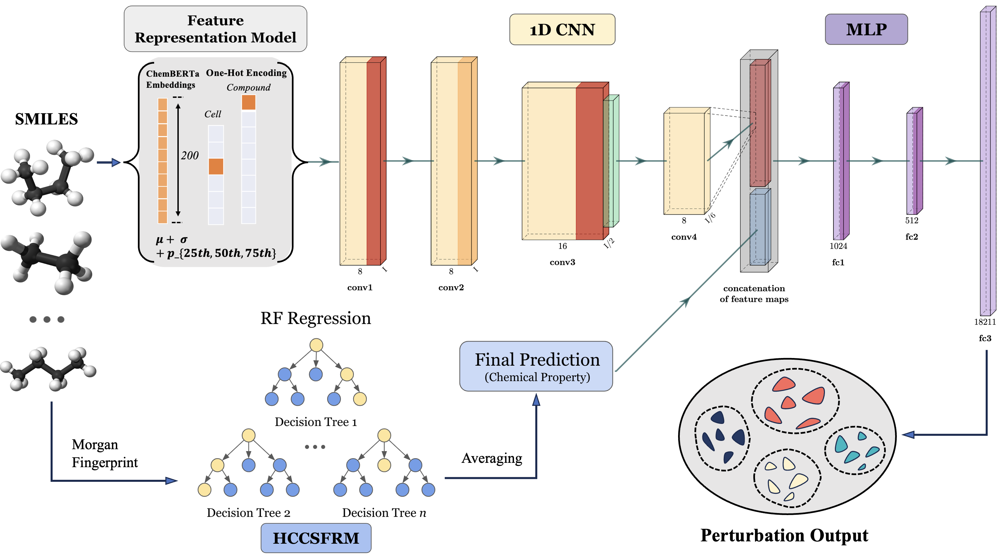
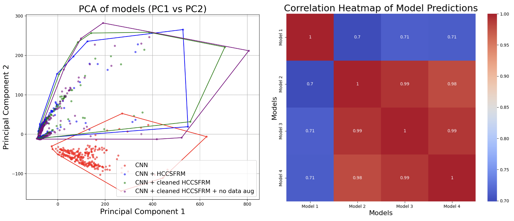

# Single Cell Perturbation Analysis Project Overview

## Context
**Single-cell perturbation prediction** techniques utilize molecular features of compounds to estimate changes in gene expression across different cell types under chemical perturbations, thereby enabling drug performance predictions and facilitating drug screening. The technology holds significant value in fields such as biopharmaceuticals and biotechnology as it significantly reduces research and development costs and shortens the development cycle. However, because the extraction process of chemical molecular features is challenging, the relationship between gene expression and chemical perturbations is complex, and the theoretical foundation for existing prediction methods is weak, predictive accuracies often do not appear at the desired level. 

## Project Overview
To address these challenges, this project proposes a CNN model with an attention mechanism that combines deep and handcrafted features. The model first introduces the ChemBERTa feature representation model to extract encoded features from the SMILES strings of chemical molecules. At the same time, a random forest (RF) model is pre-trained to predict handcrafted molecular structure features from the SMILES strings. Then, a one-dimensional CNN and the pre-trained RF model are used to extract deep features and handcrafted features from the molecular formulas of the chemical compounds, respectively, leading to the next step, where the two feature sets are concatenated. Finally, an attention-based deep network structure is constructed to predict changes in single-cell gene expression. This method combines handcrafted and deep features to establish a stronger representation model. By incorporating an attention mechanism, the robustness of the network model is further enhanced and overfitting is mitigated. Extensive ablation and comparative experiments also demonstrate the effectiveness and accuracy of the proposed model.





**Plot and heatmap summary of prediction outcomes.** (Left) PCA plot on gene perturbation predictions which visualizes the generalization capability of different models, with the most improved model exhibiting the largest spread across principal components, indicating its improved ability to generalize across diverse gene perturbations. (Right) Heatmap showing the correlation between predictions of different model versions, where higher correlations between HCCSFRM models suggest significant improvements introduced by handcrafted and cleaned features.

## 1. Installation

1. Clone this repository
```
git clone https://github.com/your-username/single-cell-perturbation-analysis.git
```

2. Install dependencies
```
pip install -r requirements.txt
```
## 2. Usage

The project is divided into two main pipelines: CNN and QSAR. Refer to the entry_point.md file for detailed instructions on how to run the complete analysis.

1. Data Preparation
```
python prepare_data.py
```

2. QSAR Model Training and Prediction:
```
python QSAR_pipeline/train_qsar.py
python QSAR_pipeline/predict_qsar.py
python QSAR_pipeline/scale_qsar.py
```

3. QSAR Pipeline:
```
python QSAR_pipeline/train.py
python QSAR_pipeline/predict.py
```

## 3.  Visualization
The `data_vis.py` file contains functions to visualize the data, including MRRMSE plots for different model configurations.

The `pca_vis.py` file visualizes PCA plots for different model configurations.

## 4. Configuration
The `config` directory contains JSON files for training and testing data configurations.

## 5. Contributing
We welcome contributions to this project. 

## 6. License
This project is licensed under the Apache License. See the LICENSE file for more details.

## 7. Contact
For any questions or inquiries, feel free to contact me at guangyu.chen40730-biph@basischina.com!
